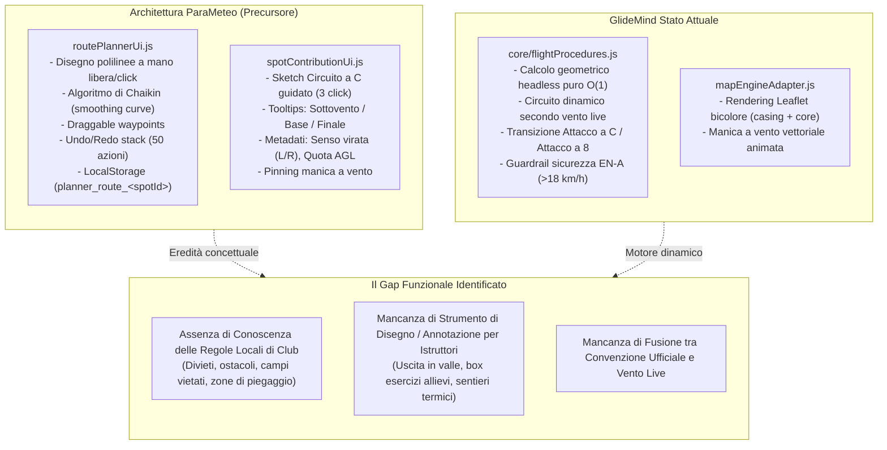
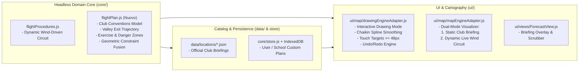

# Piano Architetturale: Drawing Engine, Procedure Scuole di Volo e Convenzioni Aeroclub

> **Stato**: Proposta Architetturale & Master Plan (Boost / Plan)  
> **Target Repo**: `GlideMind`  
> **Riferimenti Chiave**: `core/flightProcedures.js`, `ui/map/mapEngineAdapter.js`, ParaMeteo `routePlannerUi.js`, ParaMeteo `spotContributionUi.js`, Foto Bacheca Parapendio Club Cavallaria

---

## 1. Origine del Rendering Esistente e Diagnosi

### 1.1 Identificazione del Disegno nello Screenshot
Il tracciato visualizzato nello screenshot (`media_1791635560686_879aa554.png`) è il risultato del **motore geometrico deterministico di GlideMind** (`core/flightProcedures.js`), renderizzato tramite Leaflet in `ui/map/mapEngineAdapter.js` all'interno dell'overlay di Analisi Volo Comprensorio (`ForecastView.js`):

| Elemento Visivo nello Screenshot | Modulo Sorgente GlideMind | Significato Aeronautico |
| :--- | :--- | :--- |
| **Tratto Marrone (`#b45309`)** | `calculateLandingCircuit().polylines.downwindLeg` | Braccio di **Sottovento** (Downwind) a favore di vento |
| **Tratto Blu (`#2563eb`)** | `calculateLandingCircuit().polylines.baseLeg` | Braccio di **Base** trasversale a 90° |
| **Tratto Verde (`#15803d`)** | `calculateLandingCircuit().polylines.finalLeg` | Braccio di **Finale** esattamente controvento |
| **Cerchio Tratteggiato Viola (`#6366f1`)** | `calculateLandingCircuit().holdingArea` | Settore di **Smaltimento Quota** (Holding/Altitude-loss) |
| **Pin `⏚ 800m` con Manica a Vento** | `renderComprensorioFlightMap()` | Punto di contatto / Touchdown con quota e orientamento brezza |
| **Linea Tratteggiata Verde** | `flightGlideLine` | Asse di discesa o linea di planata decollo-atterraggio |

Questo circuito viene attualmente generato **in tempo reale ad ogni ora dello scrubber** in funzione della velocità e della direzione del vento calcolate da Open-Meteo.

---

## 2. Analisi Comparativa: ParaMeteo vs GlideMind

Dall'ispezione della base di codice di `ParaMeteo` (`C:\github\ParaMeteo\`), emergono due sottosistemi cardine che rispondevano a questa esigenza:



---

## 3. Analisi della Documentazione sul Campo (Bacheche Aeroclub Cavallaria)

Dall'analisi delle fotografie dell'album fotografico del **Parapendio Club Cavallaria** (Brosso / Lessolo), si evidenzia una struttura di briefing standard adottata dagli aeroclub reali:

1. **Zonizzazione Geometrica dell'Atterraggio (Landing Area Zoning)**:
   - **Zona Verde (Landing Area)**: Area consentita con confini delimitati fisicamente sul terreno (paletti gialli) e bersaglio di precisione al centro.
   - **Zone Rosse (No-Landing / Proprietà Altrui)**: Campi coltivati o zone con ostacoli/rotori in cui vige il divieto assoluto di atterraggio.
   - **Zona Arancione (Folding Area)**: Spazio dedicato al ripiegamento delle vele, posizionato a monte/bordo campo per non intralciare i piloti in finale.
   - **Zona Azzurra (Parcheggio & Transito)**: Viabilità interna regolamentata con ingresso e uscita a senso unico.
   - **Posizione Manica a Vento**: Punto fisso anemometrico ben visibile dall'avvicinamento.
2. **Procedura Didattica per Scuole di Volo (Allievi EN-A)**:
   - **Uscita in Valle**: Corridoio di planata prescritto dal decollo (es. Manifestazione o Cavallaria Alto) verso l'imbocco della Valchiusella, con quote minime di sicurezza sopra le dorsali intermedie (es. Casette 1300m, Felci 930m).
   - **Area Esercizi (Training Box)**: Spazio aereo sicuro al centro della valle, con margine verticale elevato dal suolo (>300m AGL), dove gli studenti eseguono le manovre prescritte (360°, variazioni di assetto, grandi orecchie) prima di entrare nel circuito di perdita quota.
   - **Circuito di Atterraggio Ufficiale**: Asse preferenziale e senso di virata convenzionale stabilito dal Club (es. virate a sinistra per evitare case e ostacoli).

---

## 4. Architettura del Sistema Proposto (GlideMind Flight Briefing & Drawing)

L'architettura proposta estende GlideMind secondo il principio di **Purezza Headless Core** (zero DOM nel core) e **Touch Ergonomics Outdoor**:



### 4.1 Modello Dati del Piano di Volo (`core/flightPlan.js`)

```javascript
/**
 * Flight Plan & Club Procedure Schema
 */
export const FlightPlanSchema = {
  id: 'cavallaria_official_school',
  comprensorioId: 'monte_cavallaria',
  title: 'Piano Didattico & Convenzione Ufficiale Cavallaria',
  author: 'Parapendio Club Cavallaria A.S.D.',
  
  // 1. Corridoio di Uscita in Valle dal Decollo
  valleyExit: {
    takeoffId: 'manifestazione',
    waypoints: [
      { lat: 45.51345, lon: 7.79690, minAltMsl: 1380, label: 'Decollo Manifestazione' },
      { lat: 45.50910, lon: 7.80420, minAltMsl: 1100, label: 'Sorvolo Cresta Felci' },
      { lat: 45.50200, lon: 7.81800, minAltMsl: 750, label: 'Ingresso Valle Lessolo' }
    ],
    smooth: true // Applicazione spline di Chaikin
  },

  // 2. Box Esercizi Didattici (Student Training Box)
  exerciseZone: {
    name: 'Area Manovre Valle di Lessolo',
    polygon: [
      [45.5040, 7.8150],
      [45.5060, 7.8250],
      [45.5000, 7.8290],
      [45.4980, 7.8190]
    ],
    minAltAgl: 300,
    maxAltAgl: 800,
    allowedManeuvers: ['360° controllati', 'Beccheggio e Rollio', 'Grandi Orecchie', 'Acceleratore']
  },

  // 3. Geometria del Campo di Atterraggio & Zonizzazione (come da foto aeroclub)
  landingZone: {
    landingId: 'lessolo',
    touchdown: { lat: 45.498300, lon: 7.828300, alt: 320 },
    authorizedPolygon: [ /* perimetro verde con paletti */ ],
    forbiddenPolygons: [ /* zone rosse proprietà private */ ],
    foldingAreaPolygon: [ /* zona arancione ripiegamento */ ],
    parkingAreaPolygon: [ /* zona azzurra */ ],
    windsocks: [
      { lat: 45.498600, lon: 7.828800, name: 'Manica Campo Principale' }
    ]
  },

  // 4. Convenzione Circuito di Traffico Standard
  circuitConvention: {
    preferredType: 'standard_c',
    mandatoryHand: 'left', // 'left' | 'right' | 'both'
    preferredHeading: 160, // Asse della brezza tipica pomeridiana
    holdingArea: {
      center: { lat: 45.499800, lon: 7.826500 },
      radiusMeters: 90,
      description: 'Smaltimento quota sopra i prati aperti a Nord-Ovest del campo'
    },
    notes: 'Virate rigorosamente a sinistra per evitare il sorvolo delle case e i rotori della vegetazione a Est.'
  }
};
```

---

## 5. Master Plan Operativo: Roadmap a 4 Fasi

### Fase 1: Domain Core Headless & Fusione Geometrica (`core/`)
- Creare il modulo `core/flightPlan.js` con:
  - Validatori di schema deterministici (coordinate WGS84, altitudini AGL/MSL, poligoni chiusi).
  - Algoritmo di spline di Chaikin headless puro per ammorbidire le polilinee di rotta.
  - Funzione di fusione `fuseCircuitWithConvention(dynamicCircuit, clubConvention)`:
    - Se il club impone `mandatoryHand: 'left'`, il circuito dinamico calcolato con il vento live rispetta il senso di virata imposto, orientando il finale controvento ma sviluppando il sottovento sul lato prescritto.
    - Se il vento è in contrasto pericoloso con l'asse del campo, genera warning aeronautico esplicito per allievi.
- Test unitari completi in Node.js puro (`tests/core/flightPlan.test.mjs`).

### Fase 2: Motore di Disegno e Annotazione Interattivo (`ui/map/drawingEngineAdapter.js`)
- Implementare il controller di disegno su Leaflet (ispirato a `routePlannerUi.js` di ParaMeteo, modernizzato e conformato alle `laws-of-ux`):
  - **Modalità Polyline (Corridoio di Volo & Uscita in Valle)**:
    - Click/tap per posizionare waypoints.
    - Marker circolari draggable con touch target di $\ge 48\times 48\text{px}$ per uso outdoor con guanti.
    - Calcolo live della distanza chilometrica totale e dislivello.
  - **Modalità Poligono (Aree Esercizi, Campi Atterraggio, Zone Vietate)**:
    - Generazione contorno poligonale con riempimento semitrasparente (Verde per autorizzato, Rosso tratteggiato per divieto, Arancione per ripiegamento, Viola per box esercizi).
  - **Undo / Redo Stack**:
    - Fino a 50 stati reversibili, con pulsanti tattili in toolbar a sbalzo.
  - **Touch Guard**:
    - Disabilitazione del drag mappa durante la modalità tracciamento attivo o pulsante dedicato "Blocca/Sblocca Navigazione Mappa" per prevenire conflitti di tocco.

### Fase 3: Visualizzatore Briefing Didattico in `ForecastView.js` e `mapEngineAdapter.js`
- Estensione dell'overlay di Analisi Volo a schermo intero (`100dvh`):
  - **Selettore a 2 Schede**:
    1. **"Meteo Live Nowcast"**: Visualizza il circuito dinamico calcolato in tempo reale con le maniche a vento vettoriali animate all'ora dello scrubber.
    2. **"Convenzione Club / Scuola"**: Visualizza il piano di volo ufficiale pubblicato (corridoio uscita in valle, area esercizi, zoning campo verde/rosso/arancione, indicazioni testuali dell'aeroclub).
  - **Step-by-Step Flight Briefing**:
    - Stepper interattivo che guida l'allievo attraverso i 5 passaggi chiave del volo locale:
      1. *Decollo & Stacco* (vento, orientamento pendio, quota)
      2. *Corridoio Uscita in Valle* (quota minima di sicurezza, rocce e cavi)
      3. *Area Esercizi* (box sicuro manovre e quota minima)
      4. *Smaltimento Quota* (settore 360° / otto)
      5. *Circuito & Finale* (sottovento, base, finale controvento, zona ripiegamento vele)

### Fase 4: Persistenza, Sharding Catalogo & Condivisione
- Arricchire il record di `Monte Cavallaria` in `data/locations/it.json` con i dati geometrici reali ricavati dalla bacheca del Parapendio Club Cavallaria.
- Supportare il salvataggio in `IndexedDB` (`storageAdapter`) per i piani di volo custom creati dagli utenti/istruttori sul proprio dispositivo.
- Export e Import in formato standard GeoJSON / JSON compresso per condivisione via WhatsApp / Telegram tra istruttore e allievi.

---

## 6. Proactive Mentorship & Critical Review Box

> [!IMPORTANT]
> **💡 Proactive Mentorship & Critical Review**
> - **⚠️ Rischio / Punto Cieco Identificato**: La sola generazione algoritmica del circuito basata sul vento matematico può suggerire un sottovento o un finale che sorvola campi coltivati con contenziosi legali (zone rosse della foto Cavallaria) o linee elettriche invisibili al DEM. Al contrario, un disegno statico non tiene conto delle rotazioni della brezza durante la giornata (es. vento da Sud al pomeriggio vs vento da Nord-Est al mattino).
> - **⚖️ Trade-off & Alternativa Migliore**: Adottare una **fusione a due livelli (Hybrid Procedural Engine)**: la convenzione del Club fissa i vincoli fisici inviolabili (poligoni di atterraggio verde, zone rosse interdette, senso di virata obbligatorio per evitare le case), mentre il motore meteo adatta dinamicamente l'asse del finale controvento e la lunghezza del rettifilo in base alla velocità del vento live calcolata da Open-Meteo.
> - **🎯 Ottimizzazione Workflow / Next Steps**: Procedere implementando prima il modello di dati headless `core/flightPlan.js` e la renderizzazione della zonizzazione di atterraggio (verde/rosso/arancione come da foto Cavallaria), per poi innestare la modalità di disegno interattivo.
