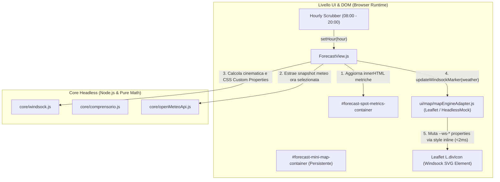

# Piano Architetturale: Integrazione Mini Mappa e Manica a Vento Vettoriale in ForecastView

Questo documento definisce le specifiche tecniche, i contratti architetturali e i requisiti operativi per integrare la mini mappa contestuale e la manica a vento aerodinamica animata nella vista di previsione (`ForecastView.js`), a valle dell'audit architetturale.

---

## 1. Obiettivo e Contesto di Dominio

Nel progetto legacy `ParaMeteo`, la scheda di dettaglio dello spot integrava una mini mappa Leaflet con una manica a vento vettoriale animata a 12 segmenti che rifletteva in tempo reale la direzione, intensità, raffiche e turbolenza calcolate da Open-Meteo per l'ora selezionata.

In GlideMind, la vista `ForecastView.js` possiede uno scrubber orario continuo (08:00 - 20:00) e indicatori numerici/grafici, ma è priva del riscontro visivo orografico immediato sul decollo. L'obiettivo è reintegrare questo componente mantenendo la separazione assoluta tra:
1. **Core Headless (`core/windsock.js`)**: calcolo cinematico puro, deformazione fisica aerodinamica ed emissione SVG string senza alcuna dipendenza DOM (conforme a Shift-Left Gate 1).
2. **Adapter Cartografico (`ui/map/mapEngineAdapter.js`)**: estensione del supporto per mini-mappe su `LeafletMapEngine` e `HeadlessMockMapEngine`, con marker `L.divIcon`, mutazione chirurgica del marker manica a vento e layout timing safe (`invalidateSize`).
3. **Controller UI (`ui/views/ForecastView.js`)**: separazione fisica dei contenitori DOM tra metriche testuali (`#forecast-spot-metrics-container`) e mappa persistente (`#forecast-mini-map-container`), prevenendo la distruzione di Leaflet durante lo scrubbing continuo (<50ms).
4. **Token Grafici & Animazione Statiche (`css/theme.css`)**: regole `@keyframes` statiche parametrizzate da CSS Custom Properties per zero CSSOM churn a 60 FPS.

---

## 2. Architettura dei Componenti e Flusso Dati



---

## 3. Specifiche Tecniche Dettagliate

### 3.1. Modulo Core Headless: `core/windsock.js`
- **Isolamento Headless Assoluto**: zero dipendenze da `window`, `document`, `HTMLElement`, `querySelector` o `Canvas`. 100% testabile ed eseguibile in ambiente Node.js puro (`Shift-Left Gate 1`).
- **Parametri Fisici di Ingresso**:
  - `speed` (number, km/h): velocità nominale del vento a quota decollo (o al suolo per atterraggio).
  - `gust` (number, km/h): velocità massima delle raffiche.
  - `direction` (number, deg $0..360$): azimut di provenienza del vento (la manica si orienta a $\text{direction} + 180^\circ$).
  - `turbulence` (number, $0..1$): coefficiente di turbolenza/EDR derivato da sounding termodinamico.
  - `options` (object): opzioni accessorie (scala grafica, classe CSS di prefisso).
- **Funzioni Esportate**:
  - `calculateWindsockKinematics(speed, gust, direction, turbulence)`:
    - **Angolo Base Puntatore**: $\theta_{\text{pointing}} = (\text{direction} + 180) \bmod 360$.
    - **Inclinazione Droop (Gravità vs Portanza)**:
      - Vento calmo ($< 3\text{ km/h}$): manica floscia a riposo orientata verticalmente verso il basso ($90^\circ$ di inclinazione dal palo).
      - Flusso moderato ($4 - 18\text{ km/h}$, range ideale EN-A): sollevamento progressivo parabolico da $30^\circ$ a $75^\circ$.
      - Vento forte ($> 22\text{ km/h}$): manica completamente orizzontale ($0^\circ$ di inclinazione dal piano di flusso).
    - **Frequenza e Periodo di Oscillazione (Flutter)**:
      - Periodo $T = \max(1.1, 3.2 - (\text{speed} / 25) - (\text{turbulence} \times 1.2))\text{ s}$.
    - **Ampiezza Angolare di Oscillazione (Imbardata / Whip Wave)**:
      - $\Delta \theta = \min(18^\circ, 2^\circ + (\text{gust} - \text{speed}) \times 0.65 + \text{turbulence} \times 8^\circ)$.
    - **Allungamento Longitudinale (Scale Factor)**:
      - Allungamento base legato alla pressione dinamica: $s_y = \min(1.5, 0.4 + \text{speed} / 22)$.
      - Allungamento dinamico sotto raffica: $s_{\text{gust}} = \min(1.75, 0.4 + \text{gust} / 20)$.
  - `generateWindsockSvg(speed, gust, direction, turbulence, options)`:
    - Restituisce la stringa SVG pura dell'anello metallico di ancoraggio, del palo, dei 12 segmenti articolati a bande alternate e del terminale di scarico.
    - Assegna al nodo radice `<svg>` le CSS Custom Properties calcolate (`--ws-base-angle`, `--ws-droop-angle`, `--ws-osc-amp`, `--ws-scale-y`, `--ws-flutter-period`).
    - Zero iniezione di tag `<style>` o definizioni `@keyframes` inline (la classe CSS fa riferimento all'animazione statica in `css/theme.css`).

### 3.2. Estensione Map Engine Adapter: `ui/map/mapEngineAdapter.js`
- **Supporto Mini-Mappa in `LeafletMapEngine` e `HeadlessMockMapEngine`**:
  - `renderSpotMiniMap(containerEl, spotData, options)`:
    - Configura Leaflet con interazioni touch non invasive: `dragging: false`, `touchZoom: false`, `scrollWheelZoom: false`, `doubleClickZoom: false`, `zoomControl: false`, `attributionControl: false`.
    - Tile layer reattivo sincronizzato con il tema attivo (`MAP_THEMES.dark` o `MAP_THEMES.light`).
    - Modalità "Panoramica (Binomio)": calcola il bounding box geografico tra Decollo e Atterraggio e applica `fitBounds(..., { padding: [25, 25], maxZoom: 15 })`.
    - Modalità "Decollo Singolo": centra a zoom 15 sul decollo selezionato con settore conico di decollo orientato sull'azimut del pendio.
    - Modalità "Atterraggio Singolo": centra a zoom 15 sull'atterraggio selezionato con marker atterraggio e manica a vento di superficie al suolo.
    - Cono/linea di planata: polilinea tratteggiata con gradiente semaforico verde/giallo/rosso in base al rapporto di efficienza aerodinamica calcolato con correzione vento (`calculateWindCorrectedGlideRatio`).
    - Marker manica a vento: inserito come `L.divIcon` con classe `.gm-windsock-marker-container`.
    - **Salvaguardia Layout Timing**: esecuzione immediata di `requestAnimationFrame(() => { if (this.map) this.map.invalidateSize(); })`.
  - `updateWindsockMarker(weatherSnapshot, isLanding = false)`:
    - Recupera l'elemento DOM del marker manica a vento ed esegue in $< 2\text{ms}$ l'aggiornamento delle CSS Custom Properties sull'elemento radice SVG (`setProperty('--ws-base-angle', ...)`).
  - `updateGlideLine(glideMetrics)`:
    - Aggiorna il colore (`setStyle({ color })`) e il testo del tooltip della polilinea di planata senza ricreare il layer.
  - `setTheme(theme)`:
    - Aggiorna istantaneamente il layer tile da CartoDB Dark Matter a CartoDB Voyager Sunlight Mode.

### 3.3. Integrazione Layout & Ergonomia in `ui/views/ForecastView.js`
- **Disaccoppiamento dei Contenitori DOM**:
  - La sezione della scheda spot (`#forecast-spot-card-container`) viene strutturata con:
    1. `#forecast-spot-metrics`: contiene le intestazioni, le etichette di decollo/atterraggio, le quote, la velocità del vento in km/h, i punti cardinali e la motivazione fisica (`evalData.reason`). Questo blocco viene aggiornato tramite `innerHTML` su `setHour()`.
    2. `#forecast-mini-map-container`: blocco persistente che ospita il canvas Leaflet (`#forecast-mini-map`). Questo blocco **NON** viene mai toccato da `setHour()`.
- **Posizionamento e Dimensionamento Mobile Outdoor**:
  - Su mobile (< 768px): posizionato subito sotto la riga delle metriche aeronautiche; altezza fissa `170px`, larghezza `100%`, `border-radius: var(--gm-radius-lg)`.
  - Su desktop (>= 768px): layout a 2 colonne affiancate (sinistra metriche, destra mini-mappa orografica).
  - Proprietà CSS `touch-action: pan-y` esplicita per prevenire il blocco dello scorrimento verticale mobile verso le schede parametri inferiori.
- **Affordance e Cheap Takeover (Laws of UX)**:
  - Pulsante touch d'angolo $\ge 44 \times 44\text{px}$ `⤢` (e intero container mappa cliccabile) che attiva l'azione `open-full-map`: sincronizza `store.selectedSpot` e reindirizza istantaneamente a `#map?spot=${spot.id}`.
- **Ciclo di Vita e Prevenzione Memory Leak**:
  - Prima di ogni ri-rendering completo della vista (`this.render()`, cambio spot o cambio data), invocazione di `if (this.miniMapEngine) this.miniMapEngine.destroy()`.
  - Invocazione obbligatoria di `this.miniMapEngine.destroy()` all'interno del metodo `unmount()`.
  - Aggiornamento reattivo del tema mappa in `store.subscribe` all'evento `themeChange`.

### 3.4. Token Grafici e Animazione Statica (`css/theme.css`)
- **Regola `@keyframes` Statica**:
  ```css
  @keyframes gm-windsock-flutter {
    0%, 100% {
      transform: rotate(calc(var(--ws-base-angle) - var(--ws-osc-amp))) scaleY(var(--ws-scale-y));
    }
    50% {
      transform: rotate(calc(var(--ws-base-angle) + var(--ws-osc-amp))) scaleY(calc(var(--ws-scale-y) * 1.06));
    }
  }
  ```
- **Contenitore e Tile Styling**:
  - Isolamento stacking context: `.gm-mini-map-box { position: relative; height: 170px; width: 100%; border-radius: var(--gm-radius-lg); overflow: hidden; }`.
  - Bordo ad alto contrasto conforme al tema attivo (`border: 1px solid var(--gm-border)`).

---

## 4. Matrice Casi Limite & Vincoli di Sicurezza

| Scenario Limite | Rischio | Meccanismo di Protezione |
| :--- | :--- | :--- |
| **Vento Calmo ($< 3\text{ km/h}$)** | Manica fluttuante fittizia in assenza di flusso | Droop angle forzato a $90^\circ$ (floscia verso il basso), opacità $0.6$, oscillazione disattivata (`--ws-osc-amp: 0deg`). |
| **Raffiche Violente ($\Delta > 18\text{ km/h}$)** | Deformazione visiva sballata e layout jank | Clamping dell'allungamento `scaleY` a max $1.75\times$ con ampiezza oscillazione limitata a max $\pm 18^\circ$. |
| **Sub-Spot Atterraggio Selezionato** | Manica a vento fuori dal campo visivo della mappa | Centratura su atterraggio e ancoraggio del marker manica a vento di superficie sulle coordinate dell'atterraggio. |
| **Scorrimento Scrubber Rapido** | Distruzione Leaflet e layout thrashing | Container mini-mappa isolato; aggiornamento a 0ms tramite sola mutazione CSS custom properties su DOM marker esistente. |
| **Rendering in Contenitore Flexbox Non Computato** | Mappa grigia o tessere disallineate (`0x0` size) | Invocazione programmata di `requestAnimationFrame(() => this.map.invalidateSize())`. |
| **Esecuzione Test Headless Node.js** | Errore `window is not defined` o `L is not defined` | `core/windsock.js` puro senza DOM; `mapEngineAdapter.js` istanzia `HeadlessMockMapEngine` con validazione degli stati senza DOM reale. |

---

## 5. Piano Operativo di Esecuzione (Task Checklist)

- [x] **Step 1: Core Headless Puro (`core/windsock.js` & `tests/core/windsock.test.mjs`)**
  - Implementazione delle funzioni cinematiche pure `calculateWindsockKinematics` e `generateWindsockSvg`.
  - Assenza assoluta di riferimenti DOM (Gate 1 compliance verificata con `tests/ui/shiftLeftGovernance.test.mjs`).
  - Suite di test unitari con asserzioni deterministiche su angoli, frequenze, droop, e formati SVG.
- [x] **Step 2: Token CSS e Animazione Statica (`css/theme.css`)**
  - Definizione dell'animazione `@keyframes gm-windsock-flutter` parametrizzata da CSS Custom Properties.
  - Definizione degli stili per `.gm-mini-map-box`, `.gm-windsock-scaler`, pulsante di espansione e layout responsive a 2 colonne.
- [x] **Step 3: Estensione Adapter Cartografico (`ui/map/mapEngineAdapter.js`)**
  - Implementazione di `renderSpotMiniMap`, `updateWindsockMarker` e `updateGlideLine` sia su `LeafletMapEngine` sia su `HeadlessMockMapEngine`.
  - Salvaguardia `invalidateSize()` con `requestAnimationFrame`.
- [x] **Step 4: Ristrutturazione Contenitori DOM in `ui/views/ForecastView.js`**
  - Separazione tra `#forecast-spot-metrics-container` e `#forecast-mini-map-container`.
  - Inizializzazione della mini mappa in `render()`.
  - In `setHour()`: mutazione chirurgica delle metriche testuali e aggiornamento del marker manica a vento a 0ms senza distruggere Leaflet.
- [x] **Step 5: Ciclo di Vita, Sub-Spot e Cambio Tema**
  - Pulizia memoria con `miniMapEngine.destroy()` in `unmount()` e prima dei ri-render completi.
  - Centratura dinamica e posizionamento manica a vento su decollo vs atterraggio.
  - Sincronizzazione tema tile in `store.subscribe`.
- [x] **Step 6: Suite di Test Deterministi (`tests/ui/forecastView.test.mjs`) & Quality Gates**
  - Test per l'aggiornamento orario dello scrubber senza distruzione della mini mappa.
  - Test per la pulizia in `unmount()` e switch tema.
  - Esecuzione di `npm test` con passaggio al 100% di tutti i test (393/393 passati, zero regressioni).
