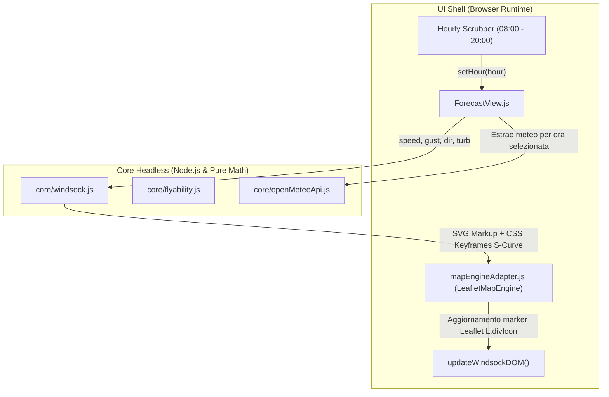

# Piano Architetturale: Integrazione Mini Mappa e Manica a Vento Vettoriale in ForecastView

Questo documento definisce le specifiche tecniche, i contratti architetturali e i requisiti operativi per integrare la mini mappa contestuale e la manica a vento aerodinamica animata nella vista di previsione (`ForecastView.js`).

---

## 1. Obiettivo e Contesto di Dominio

Nel progetto legacy `ParaMeteo`, la scheda di dettaglio dello spot integrava una mini mappa Leaflet con una manica a vento vettoriale animata a 12 segmenti che rifletteva in tempo reale la direzione, intensità, raffiche e turbolenza calcolate da Open-Meteo per l'ora selezionata.

In GlideMind, la vista `ForecastView.js` possiede uno scrubber orario continuo (08:00 - 20:00) e indicatori numerici/grafici, ma è priva del riscontro visivo orografico immediato sul decollo. L'obiettivo è reintegrare questo componente mantenendo la separazione tra:
1. **Core Headless (`core/windsock.js`)**: calcolo matematico, deformazione fisica e generazione SVG pura senza dipendenze DOM.
2. **Adapter Cartografico (`ui/map/mapEngineAdapter.js`)**: estensione del supporto per mini-mappe con marker divIcon e cono di planata.
3. **Controller UI (`ui/views/ForecastView.js`)**: ancoraggio ergonomico all'interno della scheda spot, aggiornamento reattivo senza ricaricamento dei tile e gestione del ciclo di vita.

---

## 2. Architettura dei Componenti

---

## 3. Specifiche Tecniche Dettagliate

### 3.1. Modulo Core Headless: `core/windsock.js`
- **Zero DOM Dependencies**: nessuna chiamata a `window`, `document`, `HTMLElement` o `Canvas`. 100% testabile in ambiente Node.js.
- **Parametri di ingresso**:
  - `speed` (number, km/h): velocità nominale del vento a quota decollo.
  - `gust` (number, km/h): intensità delle raffiche.
  - `direction` (number, deg $0..360$): azimut di provenienza del vento (la manica si orienta a $\text{direction} + 180^\circ$).
  - `turbulence` (number, $0..1$): fattore di turbolenza/EDR derivato da sounding adiabatico.
  - `prefix` (string, default `'fc-'`): prefisso univoco per evitare collisioni nelle regole CSS `@keyframes`.
  - `scale` (number, default `0.45`): fattore di scala per compattare la manica nelle dimensioni della mini-mappa.
- **Funzioni Esportate**:
  - `calculateWindsockKinematics(speed, gust, direction, turbulence)`: calcola lunghezze dei 12 segmenti ($L = \min(v \times 3.5, 88\text{px})$), allungamento gust ($L_{\text{gust}} = \min(g \times 3.5, 95\text{px})$), periodo di oscillazione e frequenza.
  - `generateWindsockSvg(speed, gust, direction, turbulence, options)`: restituisce la stringa HTML/SVG completa con stili inline e regole `@keyframes` per la propagazione a frusta (*whip-wave*).
  - `updateWindsockDOM(containerEl, speed, gust, direction, turbulence, prefix)`: funzione helper eseguita solo se `window` è definito, che muta chirurgicamente i percorsi SVG e l'angolo di rotazione senza distruggere il nodo DOM.

### 3.2. Estensione Map Engine Adapter: `ui/map/mapEngineAdapter.js`
- **Metodo `renderSpotMiniMap(containerEl, spotData, options)`**:
  - Configura Leaflet con controlli semplificati: `dragging: false` su mobile (per non intrappolare lo scroll verticale della pagina), `zoomControl: false`, `attributionControl: false`.
  - Tile layer conforme al tema attivo (`MAP_THEMES.dark` o `MAP_THEMES.light`).
  - In modalità "Panoramica (Binomio)": calcola il bounding box tra Decollo e Atterraggio e applica `fitBounds(..., { padding: [20, 20] })`.
  - In modalità "Decollo Singolo": centra a zoom 15 sul decollo selezionato.
  - In modalità "Atterraggio Singolo": centra a zoom 15 sull'atterraggio selezionato.
  - Disegna la linea di planata tratteggiata tra decollo e atterraggio con colore semaforico in base all'efficienza richiesta ($E \le 1:5.5$ per vela EN-A).
  - Inietta il marker manica a vento come `L.divIcon` sul decollo attivo.
- **Metodo `updateWindsockMarker(speed, gust, direction, turbulence)`**:
  - Recupera l'elemento DOM del marker manica a vento ed esegue `updateWindsockDOM(...)` in $< 5\text{ms}$, garantendo fluidità a 60 FPS durante lo scorrimento continuo dello scrubber.

### 3.3. Integrazione Layout & Ergonomia in `ui/views/ForecastView.js`
- **Posizionamento**:
  - Integrato direttamente all'interno della scheda spot (`renderSummaryCard` e `renderSpecificSpotCard`).
  - Su mobile (< 768px): posizionato subito sotto la griglia delle metriche di decollo/atterraggio, altezza `170px`, larghezza `100%`, `border-radius: 12px`.
  - Su tablet/desktop (>= 768px): layout a 2 colonne affiancate (colonna sinistra metriche aeronautiche, colonna destra mini-mappa).
- **Interazioni e Salvaguardia Scroll (Laws of UX)**:
  - `touch-action: pan-y` esplicito per non bloccare lo scorrimento naturale verso le schede parametri inferiori.
  - Icona d'angolo "Apri Mappa Completa": pulsante touch $\ge 44 \times 44\text{px}$ che reindirizza a `#map?spot=${spot.id}` impostando lo stato globale nello store.
  - Aggiornamento orario: agganciato direttamente al metodo `setHour(hour)`.
  - Gestione della memoria: invocazione obbligatoria di `miniMapEngine.destroy()` all'interno del metodo `unmount()`.

### 3.4. Token Grafici e Dual Theme Engine (`css/theme.css`)
- Supporto al doppio tema:
  - Dark Theme: tessere scure CartoDB, anello e segmenti manica ad alto contrasto su sfondo scuro.
  - Sunlight Light Mode (`data-theme="light"`): tessere CartoDB Voyager ad alta riflettanza, bordi rinforzati per visibilità sotto luce solare diretta.
- Isolamento stacking context: `z-index: 1` per il canvas mappa, `z-index: 10` per i controlli overlay.

---

## 4. Matrice Casi Limite & Vincoli di Sicurezza

| Scenario Limite | Rischio | Meccanismo di Protezione |
| :--- | :--- | :--- |
| **Vento Calmo ($< 2\text{ km/h}$)** | Manica a vento fluttuante in assenza di flusso | Opacità a riposo, manica afflosciata verticalmente a $90^\circ$, oscillazione keyframes disattivata. |
| **Raffiche Violente ($\Delta > 18\text{ km/h}$)** | Deformazione SVG eccessiva e jank grafico | Clamping dell'allungamento `scaleY` a max $1.75\times$ con periodo di pulsazione ammortizzato ($2.4\text{s}$). |
| **Nessun Atterraggio Ufficiale Presente** | Errore nel calcolo del bounding box | Fallback automatico su centratura fissa sul solo decollo con zoom 14.5. |
| **Scorrimento Scrubber Rapido** | Ricalcoli di layout (layout thrashing) | Aggiornamento chirurgico tramite mutazione CSS `transform` senza ricreazione di nodi DOM. |
| **Esecuzione Test Headless Node.js** | Errore `window is not defined` o `L is not defined` | Istanziazione automatica di `HeadlessMockMapEngine` con validazione degli stati senza DOM reale. |

---

## 5. Piano Operativo di Esecuzione (Task Checklist)

- [ ] **Step 1**: Creazione di `core/windsock.js` con logica fisica pura, formule di deformazione e test unitario `tests/core/windsock.test.mjs`.
- [ ] **Step 2**: Estensione di `ui/map/mapEngineAdapter.js` per supportare `renderSpotMiniMap` e marker manica a vento su `LeafletMapEngine` e `HeadlessMockMapEngine`.
- [ ] **Step 3**: Integrazione della mini mappa nel template della scheda spot in `ui/views/ForecastView.js` (`renderSummaryCard` e `renderSpecificSpotCard`).
- [ ] **Step 4**: Binding reattivo tra lo scrubber orario (`setHour`), cambio data, cambio sub-spot e aggiornamento manica a vento.
- [ ] **Step 5**: Pulizia memoria in `unmount()` e stili CSS dedicati in `css/theme.css` per entrambi i temi.
- [ ] **Step 6**: Estensione della suite di test `tests/ui/forecastView.test.mjs` con asserzioni deterministiche sui contratti della mini mappa e verifica assenza regressioni con `npm test`.
